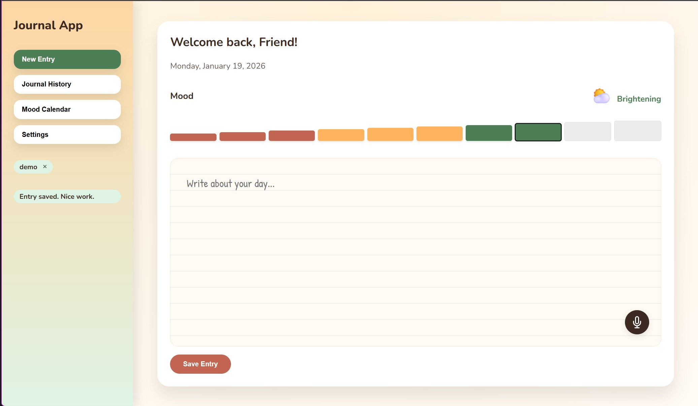
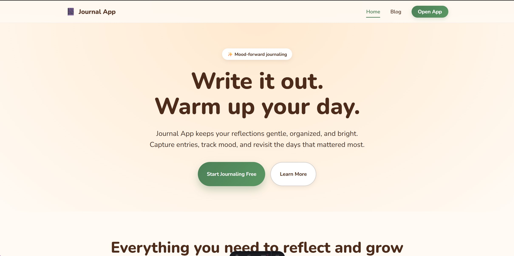

# Journal App

[](https://github.com/vam-nexus/webapp-example-journal/actions/workflows/docker-publish.yml)
[](https://github.com/vam-nexus/webapp-example-journal/pkgs/container/webapp-example-journal)
[](https://opensource.org/licenses/MIT)

**Live Demo:** https://webapp-example-journal-latest.onrender.com/

Warm, friendly journaling experience with a FastAPI backend, an Astro marketing site, and a React app.

## Screenshots





## Stack
- Backend: FastAPI (`app/main.py`)
- Web: Astro (`frontend/web`)
- App: React + Vite (`frontend/app`)
- Shared theme: `frontend/shared/theme.css`

## Local setup (uv + npm)
```powershell
uv sync
cd frontend/web
npm install
cd ../app
npm install
```

Create or adjust `frontend/app/.env` to point at the backend:
```
VITE_API_BASE=http://localhost:8000
```

## Run all components
```powershell
.\scripts\start.ps1
```

If you use the repo-level task runner, `task.json` exposes:
```bash
task dev
```

Ports:
- Backend: http://localhost:8000
- Web: http://localhost:4321
- App: http://localhost:5173

The backend reads `.env` from the repo root for JWT secrets and CORS settings, and ignores unknown variables.
In dev, it proxies `/` and `/app` to the Astro/Vite dev servers when `FRONTEND_WEB_DEV_URL` and `FRONTEND_APP_DEV_URL` are set.
For consistent routing, use `http://localhost:8000/` and `http://localhost:8000/app` in both dev and build.
The Vite app is configured with `base: "/app/"`, so direct dev access is `http://localhost:5173/app/`.

For Docker and CI, provide environment variables at runtime (the image does not bake in `.env`). Use `.env.example` as a template.

## API highlights
- Public: `/api/public/health`, `/api/public/login?username=demo`
- User: `/api/user/journal`, `/api/user/mood-calendar`, `/api/user/settings`
- Admin: `/api/admin/users`

Authentication is JWT-based with a dummy login. Use `demo` or `admin` as usernames.

## Docker
```bash
docker build -t journal-app .
docker run -p 8000:8000 journal-app
```

## Docs
Architecture and API notes live in `specs/` and should stay in sync with code changes.
